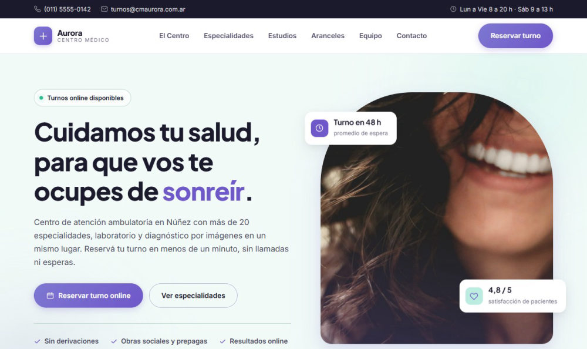

# Centro Médico Aurora



Sitio web para un centro médico de atención ambulatoria: una **landing institucional** y un
**sistema de turnos online** funcionando, conectados entre sí.

Hecho con HTML, CSS y JavaScript puros — sin frameworks, sin build, sin dependencias que instalar.

> Centro médico ficticio, creado como pieza de portfolio. Los datos de contacto, los profesionales
> y los testimonios son inventados. Los aranceles son valores orientativos de mercado.

---

## Demo

**Ver el sitio:** https://marianelasotelo.github.io/centro-medico-aurora/

Para entrar al sistema de turnos:

| Usuario | Contraseña |
|---|---|
| `marianela` | `4444` |

---

## Qué hace

### Landing (`index.html`)

- **16 especialidades** en una grilla que colapsa de 4 a 2 y a 1 columna sin dejar filas incompletas.
- **Aranceles** con los valores para pacientes particulares.
- **Equipo, testimonios y datos de contacto**, con carrusel automático que se pausa al pasar el mouse.
- Animaciones al scrollear, contadores animados, menú móvil y resaltado de la sección activa.
- Todo el movimiento respeta `prefers-reduced-motion`.

### Turnos (`turnos.html`)

- Ingreso con validación de credenciales.
- Selección **en cascada**: especialidad → profesional → horarios disponibles.
  Los horarios se leen de `data/especialistas.json`, no están escritos en el código.
- **Bloqueo de superposiciones**: no se puede reservar un horario que ese profesional ya tiene tomado.
- Fecha precargada con el día de hoy y sin permitir fechas pasadas.
- Los turnos se guardan en `localStorage`, así siguen ahí al volver.
- Cancelación con confirmación previa.

---

## Cómo verlo en tu máquina

El proyecto lee un archivo JSON con `fetch()`, y los navegadores **bloquean esas lecturas cuando
la página se abre con doble clic** (protocolo `file://`). Hay que servirlo por HTTP:

**Con Visual Studio Code:** instalá la extensión *Live Server*, botón derecho sobre `index.html`
→ *Open with Live Server*.

**Con Node:**

```bash
npx --yes http-server . -p 8080
```

**Con Python:**

```bash
python -m http.server 8080
```

Y entrás a `http://localhost:8080`.

---

## Estructura

```
.
├── index.html              Landing
├── turnos.html             Sistema de turnos
├── css/
│   ├── style.css           Variables, reset, header y footer (compartido)
│   ├── landing.css
│   └── turnos.css
├── js/
│   ├── nav.js              Menú y navegación (compartido)
│   ├── landing.js          Animaciones y carrusel
│   └── turnos.js           Lógica de reservas
├── data/
│   └── especialistas.json  Profesionales, especialidades y horarios
└── img/
```

---

## Decisiones de diseño

**Paleta.** Construida sobre cinco tonos de menta a violeta (`#BDEDE0` → `#6F58C9`). Los grises
son neutros sesgados hacia el violeta en vez de grises puros, para que todo el sitio se sienta
de la misma familia.

**Tipografía.** Plus Jakarta Sans para títulos, Inter para el texto.

**Responsive.** Verificado a 390 px de ancho sin desbordes horizontales.

**Accesibilidad.** Enlace para saltar al contenido, foco visible en todos los controles,
etiquetas asociadas a cada campo, texto alternativo en todas las imágenes y jerarquía
de encabezados coherente.

---

## Créditos

- Fotografías: [Pexels](https://www.pexels.com) y [Unsplash](https://unsplash.com), licencia libre para uso comercial.
- Diálogos: [SweetAlert2](https://sweetalert2.github.io/).
- Tipografías: [Google Fonts](https://fonts.google.com).
- Íconos: SVG dibujados a mano para este proyecto.

---

Desarrollado por **Marianela Sotelo**.
